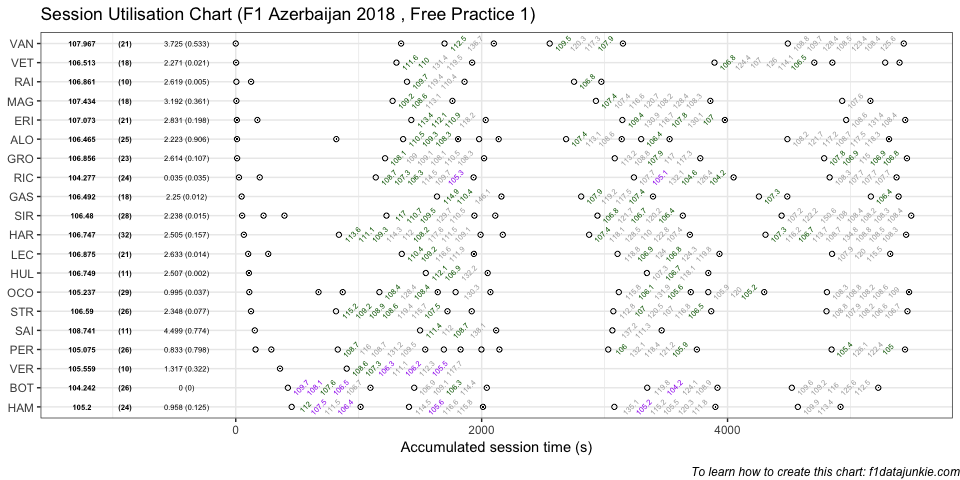
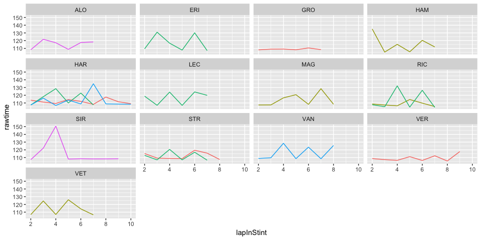

## Session Utilisation

Activity in Free Practice 1 took place as follows:

<!-- -->

### Performance Summary

| Driver            | Number | Fastest Lap | PerCent |   Gap |  Diff |
| :---------------- | -----: | ----------: | ------: | ----: | ----: |
| Valtteri BOTTAS   |     77 |     104.242 |   100.0 | 0.000 | 0.000 |
| Daniel RICCIARDO  |      3 |     104.277 |   100.0 | 0.035 | 0.035 |
| Sergio PEREZ      |     11 |     105.075 |   100.8 | 0.833 | 0.798 |
| Lewis HAMILTON    |     44 |     105.200 |   100.9 | 0.958 | 0.125 |
| Esteban OCON      |     31 |     105.237 |   101.0 | 0.995 | 0.037 |
| Max VERSTAPPEN    |     33 |     105.559 |   101.3 | 1.317 | 0.322 |
| Fernando ALONSO   |     14 |     106.465 |   102.1 | 2.223 | 0.906 |
| Sergey SIROTKIN   |     35 |     106.480 |   102.1 | 2.238 | 0.015 |
| Pierre GASLY      |     10 |     106.492 |   102.2 | 2.250 | 0.012 |
| Sebastian VETTEL  |      5 |     106.513 |   102.2 | 2.271 | 0.021 |
| Lance STROLL      |     18 |     106.590 |   102.3 | 2.348 | 0.077 |
| Brendon HARTLEY   |     28 |     106.747 |   102.4 | 2.505 | 0.157 |
| Nico HULKENBERG   |     27 |     106.749 |   102.4 | 2.507 | 0.002 |
| Romain GROSJEAN   |      8 |     106.856 |   102.5 | 2.614 | 0.107 |
| Kimi RAIKKONEN    |      7 |     106.861 |   102.5 | 2.619 | 0.005 |
| Charles LECLERC   |     16 |     106.875 |   102.5 | 2.633 | 0.014 |
| Marcus ERICSSON   |      9 |     107.073 |   102.7 | 2.831 | 0.198 |
| Kevin MAGNUSSEN   |     20 |     107.434 |   103.1 | 3.192 | 0.361 |
| Stoffel VANDOORNE |      2 |     107.967 |   103.6 | 3.725 | 0.533 |
| Carlos SAINZ      |     55 |     108.741 |   104.3 | 4.499 | 0.774 |

In Free Practice 1, Valtteri BOTTAS topped the timing sheets with a
104.242s fastest lap, 0.035 ahead of Daniel RICCIARDO in second.

### Stints Summary

| Driver            | Total laps | Longest run (laps) | Stints |
| :---------------- | ---------: | -----------------: | -----: |
| Brendon HARTLEY   |         32 |                 11 |      5 |
| Esteban OCON      |         29 |                  7 |      8 |
| Sergey SIROTKIN   |         28 |                 10 |      7 |
| Lance STROLL      |         26 |                  9 |      5 |
| Valtteri BOTTAS   |         26 |                  7 |      4 |
| Sergio PEREZ      |         26 |                  7 |      6 |
| Fernando ALONSO   |         25 |                  8 |      7 |
| Lewis HAMILTON    |         24 |                  8 |      4 |
| Daniel RICCIARDO  |         24 |                  8 |      5 |
| Romain GROSJEAN   |         23 |                  8 |      4 |
| Stoffel VANDOORNE |         21 |                  9 |      5 |
| Marcus ERICSSON   |         21 |                  8 |      5 |
| Charles LECLERC   |         21 |                  8 |      5 |
| Kevin MAGNUSSEN   |         18 |                  9 |      4 |
| Sebastian VETTEL  |         18 |                  8 |      5 |
| Pierre GASLY      |         18 |                  6 |      5 |
| Carlos SAINZ      |         11 |                  6 |      3 |
| Nico HULKENBERG   |         11 |                  5 |      3 |
| Max VERSTAPPEN    |         10 |                  9 |      2 |
| Kimi RAIKKONEN    |         10 |                  5 |      3 |

  - Brendon HARTLEY completed 32 laps over 5 stints, with a longest run
    of 11 laps and a fastest lap of 106.747s overall (12th, 102.4% of
    session best).

  - Esteban OCON completed 29 laps over 8 stints, with a longest run of
    7 laps and a fastest lap of 105.237s overall (5th, 101% of session
    best).

  - Sergey SIROTKIN completed 28 laps over 7 stints, with a longest run
    of 10 laps and a fastest lap of 106.48s overall (8th, 102.1% of
    session best).

  - Lance STROLL completed 26 laps over 5 stints, with a longest run of
    9 laps and a fastest lap of 106.59s overall (11th, 102.3% of session
    best).

  - Valtteri BOTTAS completed 26 laps over 4 stints, with a longest run
    of 7 laps and a fastest lap of 104.242s overall (1st, fastest in the
    session).

  - Sergio PEREZ completed 26 laps over 6 stints, with a longest run of
    7 laps and a fastest lap of 105.075s overall (3rd, 100.8% of session
    best).

  - Fernando ALONSO completed 25 laps over 7 stints, with a longest run
    of 8 laps and a fastest lap of 106.465s overall (7th, 102.1% of
    session best).

  - Lewis HAMILTON completed 24 laps over 4 stints, with a longest run
    of 8 laps and a fastest lap of 105.2s overall (4th, 100.9% of
    session best).

  - Daniel RICCIARDO completed 24 laps over 5 stints, with a longest run
    of 8 laps and a fastest lap of 104.277s overall (2nd, just 0.035s
    behind the fastest time in the session).

  - Romain GROSJEAN completed 23 laps over 4 stints, with a longest run
    of 8 laps and a fastest lap of 106.856s overall (14th, 102.5% of
    session best).

  - Stoffel VANDOORNE completed 21 laps over 5 stints, with a longest
    run of 9 laps and a fastest lap of 107.967s overall (19th, 103.6% of
    session best).

  - Marcus ERICSSON completed 21 laps over 5 stints, with a longest run
    of 8 laps and a fastest lap of 107.073s overall (17th, 102.7% of
    session best).

  - Charles LECLERC completed 21 laps over 5 stints, with a longest run
    of 8 laps and a fastest lap of 106.875s overall (16th, 102.5% of
    session best).

  - Kevin MAGNUSSEN completed 18 laps over 4 stints, with a longest run
    of 9 laps and a fastest lap of 107.434s overall (18th, 103.1% of
    session best).

  - Sebastian VETTEL completed 18 laps over 5 stints, with a longest run
    of 8 laps and a fastest lap of 106.513s overall (10th, 102.2% of
    session best).

  - Pierre GASLY completed 18 laps over 5 stints, with a longest run of
    6 laps and a fastest lap of 106.492s overall (9th, 102.2% of session
    best).

  - Carlos SAINZ completed 11 laps over 3 stints, with a longest run of
    6 laps and a fastest lap of 108.741s overall (20th, 104.3% of
    session best).

  - Nico HULKENBERG completed 11 laps over 3 stints, with a longest run
    of 5 laps and a fastest lap of 106.749s overall (13th, 102.4% of
    session best).

  - Max VERSTAPPEN completed 10 laps over 2 stints, with a longest run
    of 9 laps and a fastest lap of 105.559s overall (6th, 101.3% of
    session best).

  - Kimi RAIKKONEN completed 10 laps over 3 stints, with a longest run
    of 5 laps and a fastest lap of 106.861s overall (15th, 102.5% of
    session best).

### Long Runs

Laptimes on long runs of 8 or more laps
<!-- -->

-----

This website is unofficial and is not associated in any way with the
Formula 1 companies. F1, FORMULA ONE, FORMULA 1, FIA FORMULA ONE WORLD
CHAMPIONSHIP, GRAND PRIX and related marks are trade marks of Formula
One Licensing B.V.
