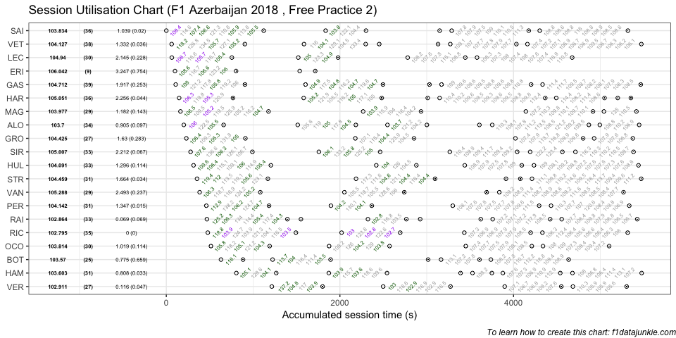
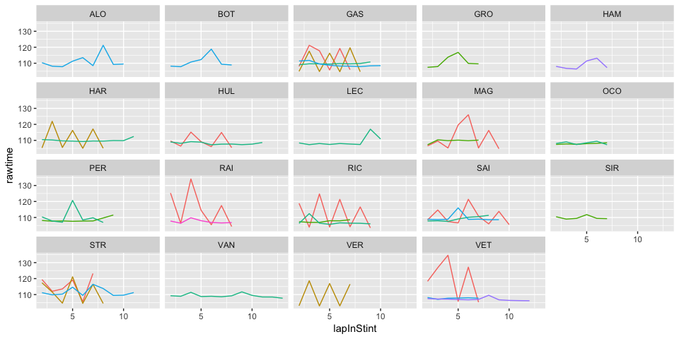

## Session Utilisation

Activity in Free Practice 2 took place as follows:

<!-- -->

### Performance Summary

| Driver            | Number | Fastest Lap | PerCent |   Gap |  Diff |
| :---------------- | -----: | ----------: | ------: | ----: | ----: |
| Daniel RICCIARDO  |      3 |     102.795 |   100.0 | 0.000 | 0.000 |
| Kimi RAIKKONEN    |      7 |     102.864 |   100.1 | 0.069 | 0.069 |
| Max VERSTAPPEN    |     33 |     102.911 |   100.1 | 0.116 | 0.047 |
| Valtteri BOTTAS   |     77 |     103.570 |   100.8 | 0.775 | 0.659 |
| Lewis HAMILTON    |     44 |     103.603 |   100.8 | 0.808 | 0.033 |
| Fernando ALONSO   |     14 |     103.700 |   100.9 | 0.905 | 0.097 |
| Esteban OCON      |     31 |     103.814 |   101.0 | 1.019 | 0.114 |
| Carlos SAINZ      |     55 |     103.834 |   101.0 | 1.039 | 0.020 |
| Kevin MAGNUSSEN   |     20 |     103.977 |   101.1 | 1.182 | 0.143 |
| Nico HULKENBERG   |     27 |     104.091 |   101.3 | 1.296 | 0.114 |
| Sebastian VETTEL  |      5 |     104.127 |   101.3 | 1.332 | 0.036 |
| Sergio PEREZ      |     11 |     104.142 |   101.3 | 1.347 | 0.015 |
| Romain GROSJEAN   |      8 |     104.425 |   101.6 | 1.630 | 0.283 |
| Lance STROLL      |     18 |     104.459 |   101.6 | 1.664 | 0.034 |
| Pierre GASLY      |     10 |     104.712 |   101.9 | 1.917 | 0.253 |
| Charles LECLERC   |     16 |     104.940 |   102.1 | 2.145 | 0.228 |
| Sergey SIROTKIN   |     35 |     105.007 |   102.2 | 2.212 | 0.067 |
| Brendon HARTLEY   |     28 |     105.051 |   102.2 | 2.256 | 0.044 |
| Stoffel VANDOORNE |      2 |     105.288 |   102.4 | 2.493 | 0.237 |
| Marcus ERICSSON   |      9 |     106.042 |   103.2 | 3.247 | 0.754 |

In Free Practice 2, Daniel RICCIARDO topped the timing sheets with a
102.795s fastest lap, 0.069 ahead of Kimi RAIKKONEN in second.

### Stints Summary

| Driver            | Total laps | Longest run (laps) | Stints |
| :---------------- | ---------: | -----------------: | -----: |
| Pierre GASLY      |         39 |                 11 |      5 |
| Sebastian VETTEL  |         38 |                 13 |      6 |
| Brendon HARTLEY   |         36 |                 12 |      7 |
| Carlos SAINZ      |         36 |                 11 |      5 |
| Daniel RICCIARDO  |         35 |                 10 |      4 |
| Fernando ALONSO   |         34 |                 11 |      6 |
| Nico HULKENBERG   |         33 |                 12 |      4 |
| Kimi RAIKKONEN    |         33 |                  9 |      7 |
| Sergey SIROTKIN   |         33 |                  8 |      5 |
| Lance STROLL      |         31 |                 12 |      5 |
| Sergio PEREZ      |         31 |                 10 |      4 |
| Lewis HAMILTON    |         31 |                  8 |      6 |
| Charles LECLERC   |         30 |                 11 |      4 |
| Esteban OCON      |         30 |                  8 |      4 |
| Stoffel VANDOORNE |         29 |                 14 |      4 |
| Kevin MAGNUSSEN   |         29 |                 10 |      4 |
| Romain GROSJEAN   |         27 |                  8 |      4 |
| Max VERSTAPPEN    |         27 |                  8 |      4 |
| Valtteri BOTTAS   |         25 |                  9 |      5 |
| Marcus ERICSSON   |          9 |                  7 |      2 |

  - Pierre GASLY completed 39 laps over 5 stints, with a longest run of
    11 laps and a fastest lap of 104.712s overall (15th, 101.9% of
    session best).

  - Sebastian VETTEL completed 38 laps over 6 stints, with a longest run
    of 13 laps and a fastest lap of 104.127s overall (11th, 101.3% of
    session best).

  - Brendon HARTLEY completed 36 laps over 7 stints, with a longest run
    of 12 laps and a fastest lap of 105.051s overall (18th, 102.2% of
    session best).

  - Carlos SAINZ completed 36 laps over 5 stints, with a longest run of
    11 laps and a fastest lap of 103.834s overall (8th, 101% of session
    best).

  - Daniel RICCIARDO completed 35 laps over 4 stints, with a longest run
    of 10 laps and a fastest lap of 102.795s overall (1st, fastest in
    the session).

  - Fernando ALONSO completed 34 laps over 6 stints, with a longest run
    of 11 laps and a fastest lap of 103.7s overall (6th, 100.9% of
    session best).

  - Nico HULKENBERG completed 33 laps over 4 stints, with a longest run
    of 12 laps and a fastest lap of 104.091s overall (10th, 101.3% of
    session best).

  - Kimi RAIKKONEN completed 33 laps over 7 stints, with a longest run
    of 9 laps and a fastest lap of 102.864s overall (2nd, 100.1% of
    session best).

  - Sergey SIROTKIN completed 33 laps over 5 stints, with a longest run
    of 8 laps and a fastest lap of 105.007s overall (17th, 102.2% of
    session best).

  - Lance STROLL completed 31 laps over 5 stints, with a longest run of
    12 laps and a fastest lap of 104.459s overall (14th, 101.6% of
    session best).

  - Sergio PEREZ completed 31 laps over 4 stints, with a longest run of
    10 laps and a fastest lap of 104.142s overall (12th, 101.3% of
    session best).

  - Lewis HAMILTON completed 31 laps over 6 stints, with a longest run
    of 8 laps and a fastest lap of 103.603s overall (5th, 100.8% of
    session best).

  - Charles LECLERC completed 30 laps over 4 stints, with a longest run
    of 11 laps and a fastest lap of 104.94s overall (16th, 102.1% of
    session best).

  - Esteban OCON completed 30 laps over 4 stints, with a longest run of
    8 laps and a fastest lap of 103.814s overall (7th, 101% of session
    best).

  - Stoffel VANDOORNE completed 29 laps over 4 stints, with a longest
    run of 14 laps and a fastest lap of 105.288s overall (19th, 102.4%
    of session best).

  - Kevin MAGNUSSEN completed 29 laps over 4 stints, with a longest run
    of 10 laps and a fastest lap of 103.977s overall (9th, 101.1% of
    session best).

  - Romain GROSJEAN completed 27 laps over 4 stints, with a longest run
    of 8 laps and a fastest lap of 104.425s overall (13th, 101.6% of
    session best).

  - Max VERSTAPPEN completed 27 laps over 4 stints, with a longest run
    of 8 laps and a fastest lap of 102.911s overall (3rd, 100.1% of
    session best).

  - Valtteri BOTTAS completed 25 laps over 5 stints, with a longest run
    of 9 laps and a fastest lap of 103.57s overall (4th, 100.8% of
    session best).

  - Marcus ERICSSON completed 9 laps over 2 stints, with a longest run
    of 7 laps and a fastest lap of 106.042s overall (20th, 103.2% of
    session best).

### Long Runs

Laptimes on long runs of 8 or more laps
<!-- -->

-----

This website is unofficial and is not associated in any way with the
Formula 1 companies. F1, FORMULA ONE, FORMULA 1, FIA FORMULA ONE WORLD
CHAMPIONSHIP, GRAND PRIX and related marks are trade marks of Formula
One Licensing B.V.
