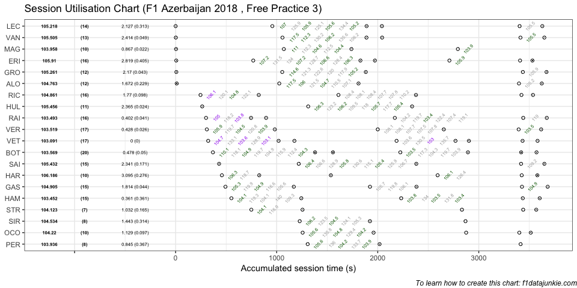
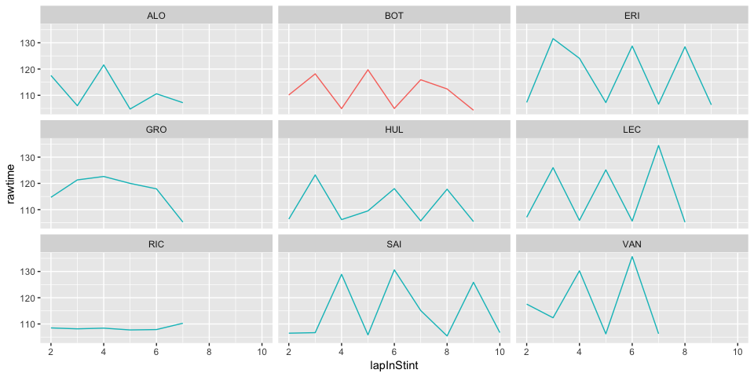

## Session Utilisation

Activity in Free Practice 3 took place as follows:

<!-- -->

### Performance Summary

| Driver            | Number | Fastest Lap | PerCent |   Gap |  Diff |
| :---------------- | -----: | ----------: | ------: | ----: | ----: |
| Sebastian VETTEL  |      5 |     103.091 |   100.0 | 0.000 | 0.000 |
| Lewis HAMILTON    |     44 |     103.452 |   100.4 | 0.361 | 0.361 |
| Kimi RAIKKONEN    |      7 |     103.493 |   100.4 | 0.402 | 0.041 |
| Max VERSTAPPEN    |     33 |     103.519 |   100.4 | 0.428 | 0.026 |
| Valtteri BOTTAS   |     77 |     103.569 |   100.5 | 0.478 | 0.050 |
| Sergio PEREZ      |     11 |     103.936 |   100.8 | 0.845 | 0.367 |
| Kevin MAGNUSSEN   |     20 |     103.958 |   100.8 | 0.867 | 0.022 |
| Lance STROLL      |     18 |     104.123 |   101.0 | 1.032 | 0.165 |
| Esteban OCON      |     31 |     104.220 |   101.1 | 1.129 | 0.097 |
| Sergey SIROTKIN   |     35 |     104.534 |   101.4 | 1.443 | 0.314 |
| Fernando ALONSO   |     14 |     104.763 |   101.6 | 1.672 | 0.229 |
| Daniel RICCIARDO  |      3 |     104.861 |   101.7 | 1.770 | 0.098 |
| Pierre GASLY      |     10 |     104.905 |   101.8 | 1.814 | 0.044 |
| Charles LECLERC   |     16 |     105.218 |   102.1 | 2.127 | 0.313 |
| Romain GROSJEAN   |      8 |     105.261 |   102.1 | 2.170 | 0.043 |
| Carlos SAINZ      |     55 |     105.432 |   102.3 | 2.341 | 0.171 |
| Nico HULKENBERG   |     27 |     105.456 |   102.3 | 2.365 | 0.024 |
| Stoffel VANDOORNE |      2 |     105.505 |   102.3 | 2.414 | 0.049 |
| Marcus ERICSSON   |      9 |     105.910 |   102.7 | 2.819 | 0.405 |
| Brendon HARTLEY   |     28 |     106.186 |   103.0 | 3.095 | 0.276 |

In Free Practice 3, Sebastian VETTEL topped the timing sheets with a
103.091s fastest lap, 0.361 ahead of Lewis HAMILTON in second.

### Stints Summary

| Driver            | Total laps | Longest run (laps) | Stints |
| :---------------- | ---------: | -----------------: | -----: |
| Valtteri BOTTAS   |         20 |                 10 |      5 |
| Sebastian VETTEL  |         17 |                  7 |      6 |
| Max VERSTAPPEN    |         17 |                  7 |      3 |
| Marcus ERICSSON   |         16 |                 10 |      5 |
| Daniel RICCIARDO  |         16 |                  8 |      3 |
| Kimi RAIKKONEN    |         16 |                  7 |      4 |
| Carlos SAINZ      |         15 |                 11 |      3 |
| Pierre GASLY      |         15 |                  7 |      3 |
| Lewis HAMILTON    |         15 |                  7 |      3 |
| Charles LECLERC   |         14 |                  9 |      4 |
| Stoffel VANDOORNE |         13 |                  8 |      4 |
| Romain GROSJEAN   |         12 |                  8 |      3 |
| Fernando ALONSO   |         12 |                  8 |      3 |
| Nico HULKENBERG   |         11 |                 10 |      2 |
| Kevin MAGNUSSEN   |         10 |                  7 |      3 |
| Esteban OCON      |         10 |                  7 |      3 |
| Brendon HARTLEY   |         10 |                  4 |      4 |
| Sergio PEREZ      |          8 |                  7 |      2 |
| Sergey SIROTKIN   |          8 |                  7 |      2 |
| Lance STROLL      |          7 |                  4 |      3 |

  - Valtteri BOTTAS completed 20 laps over 5 stints, with a longest run
    of 10 laps and a fastest lap of 103.569s overall (5th, 100.5% of
    session best).

  - Sebastian VETTEL completed 17 laps over 6 stints, with a longest run
    of 7 laps and a fastest lap of 103.091s overall (1st, fastest in the
    session).

  - Max VERSTAPPEN completed 17 laps over 3 stints, with a longest run
    of 7 laps and a fastest lap of 103.519s overall (4th, 100.4% of
    session best).

  - Marcus ERICSSON completed 16 laps over 5 stints, with a longest run
    of 10 laps and a fastest lap of 105.91s overall (19th, 102.7% of
    session best).

  - Daniel RICCIARDO completed 16 laps over 3 stints, with a longest run
    of 8 laps and a fastest lap of 104.861s overall (12th, 101.7% of
    session best).

  - Kimi RAIKKONEN completed 16 laps over 4 stints, with a longest run
    of 7 laps and a fastest lap of 103.493s overall (3rd, 100.4% of
    session best).

  - Carlos SAINZ completed 15 laps over 3 stints, with a longest run of
    11 laps and a fastest lap of 105.432s overall (16th, 102.3% of
    session best).

  - Pierre GASLY completed 15 laps over 3 stints, with a longest run of
    7 laps and a fastest lap of 104.905s overall (13th, 101.8% of
    session best).

  - Lewis HAMILTON completed 15 laps over 3 stints, with a longest run
    of 7 laps and a fastest lap of 103.452s overall (2nd, 100.4% of
    session best).

  - Charles LECLERC completed 14 laps over 4 stints, with a longest run
    of 9 laps and a fastest lap of 105.218s overall (14th, 102.1% of
    session best).

  - Stoffel VANDOORNE completed 13 laps over 4 stints, with a longest
    run of 8 laps and a fastest lap of 105.505s overall (18th, 102.3% of
    session best).

  - Romain GROSJEAN completed 12 laps over 3 stints, with a longest run
    of 8 laps and a fastest lap of 105.261s overall (15th, 102.1% of
    session best).

  - Fernando ALONSO completed 12 laps over 3 stints, with a longest run
    of 8 laps and a fastest lap of 104.763s overall (11th, 101.6% of
    session best).

  - Nico HULKENBERG completed 11 laps over 2 stints, with a longest run
    of 10 laps and a fastest lap of 105.456s overall (17th, 102.3% of
    session best).

  - Kevin MAGNUSSEN completed 10 laps over 3 stints, with a longest run
    of 7 laps and a fastest lap of 103.958s overall (7th, 100.8% of
    session best).

  - Esteban OCON completed 10 laps over 3 stints, with a longest run of
    7 laps and a fastest lap of 104.22s overall (9th, 101.1% of session
    best).

  - Brendon HARTLEY completed 10 laps over 4 stints, with a longest run
    of 4 laps and a fastest lap of 106.186s overall (20th, 103% of
    session best).

  - Sergio PEREZ completed 8 laps over 2 stints, with a longest run of 7
    laps and a fastest lap of 103.936s overall (6th, 100.8% of session
    best).

  - Sergey SIROTKIN completed 8 laps over 2 stints, with a longest run
    of 7 laps and a fastest lap of 104.534s overall (10th, 101.4% of
    session best).

  - Lance STROLL completed 7 laps over 3 stints, with a longest run of 4
    laps and a fastest lap of 104.123s overall (8th, 101% of session
    best).

### Long Runs

Laptimes on long runs of 8 or more laps
<!-- -->

-----

This website is unofficial and is not associated in any way with the
Formula 1 companies. F1, FORMULA ONE, FORMULA 1, FIA FORMULA ONE WORLD
CHAMPIONSHIP, GRAND PRIX and related marks are trade marks of Formula
One Licensing B.V.
