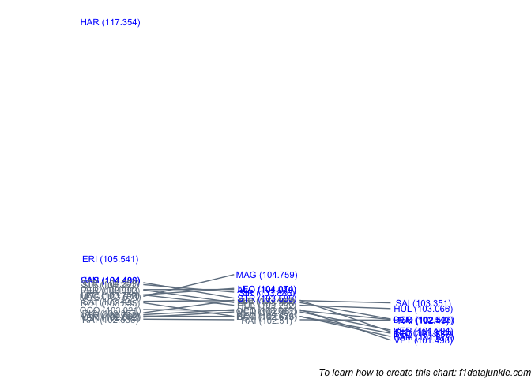

Drivers progressed through the qualifying session as follows:

<!-- -->

<!-- -->

## Q1 into Q2

The following teams did not make it through:

| TEAM         | freq |
| :----------- | ---: |
| Haas F1 Team |    1 |
| Sauber       |    1 |
| Toro Rosso   |    2 |

  - neither Toro Rosso made it through from Q1 to Q2

  - VET failed to improve his time from Q1, recording 103.015 compared
    to 102.762 (0.253s slower)

  - RIC failed to improve his time from Q1, recording 103.482 compared
    to 102.857 (0.625s slower)

  - VER failed to improve his time from Q1, recording 102.901 compared
    to 102.642 (0.259s slower)

  - SAI failed to improve his time from Q1, recording 103.464 compared
    to 103.426 (0.038s slower)

  - ALO failed to improve his time from Q1, recording 104.019 compared
    to 104.01 (0.009s slower)

  - LEC failed to improve his time from Q1, recording 104.074 compared
    to 103.752 (0.322s slower)

  - MAG failed to improve his time from Q1, recording 104.759 compared
    to 103.674 (1.085s slower)

## Q2 into Q3

The following teams did not make it through:

| TEAM         | freq |
| :----------- | ---: |
| Haas F1 Team |    1 |
| McLaren      |    2 |
| Sauber       |    1 |
| Williams     |    2 |

  - all drivers improved on their best laptime from the previous session

  - neither McLaren made it through from Q2 to Q3

  - neither Williams made it through from Q2 to Q3

  - both Ferrari cars made it through to Q3

  - both Force India cars made it through to Q3

  - both Mercedes cars made it through to Q3

  - both Red Bull cars made it through to Q3

  - both Renault cars made it through to Q3
